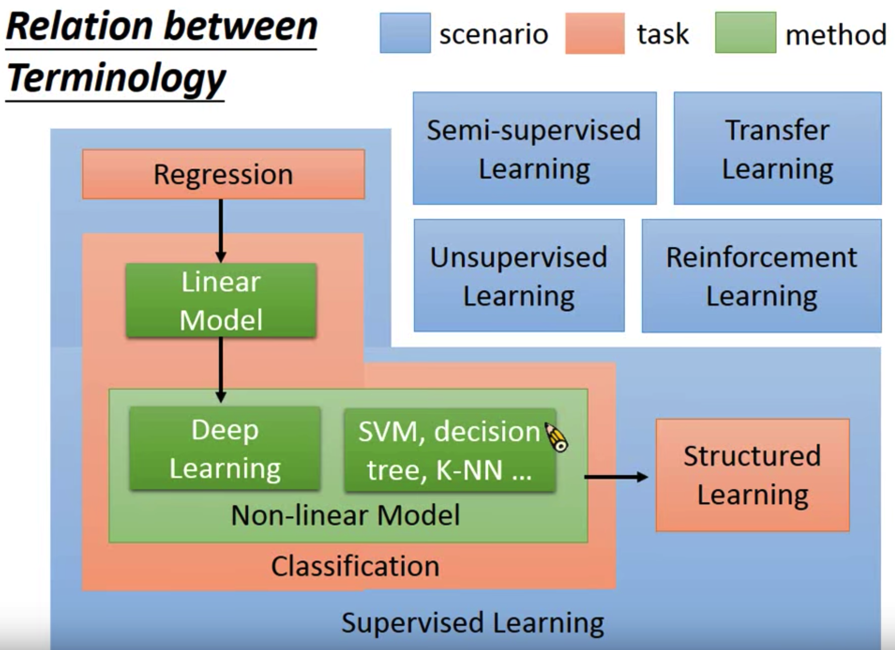
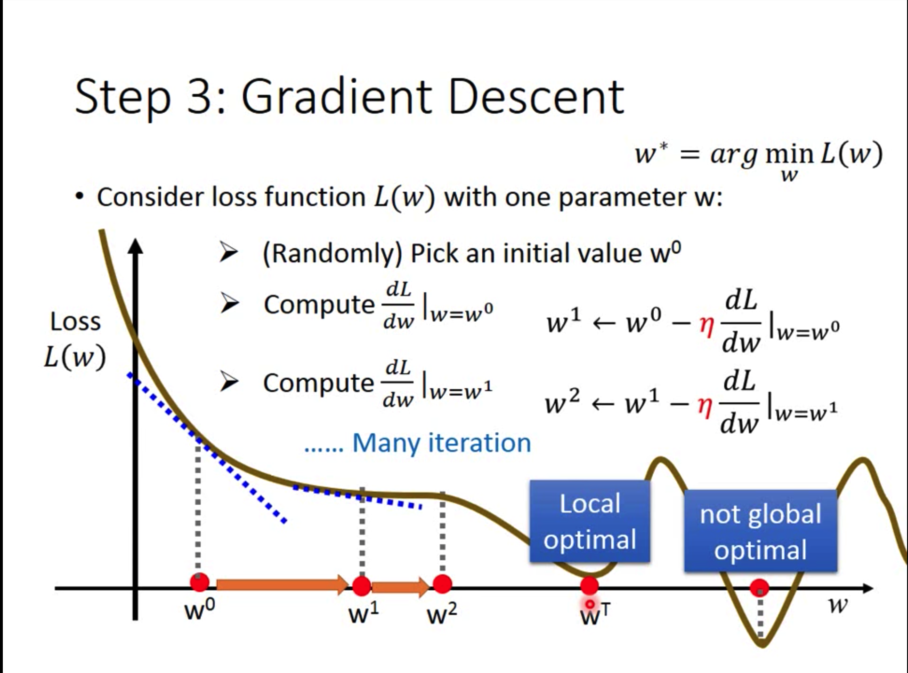
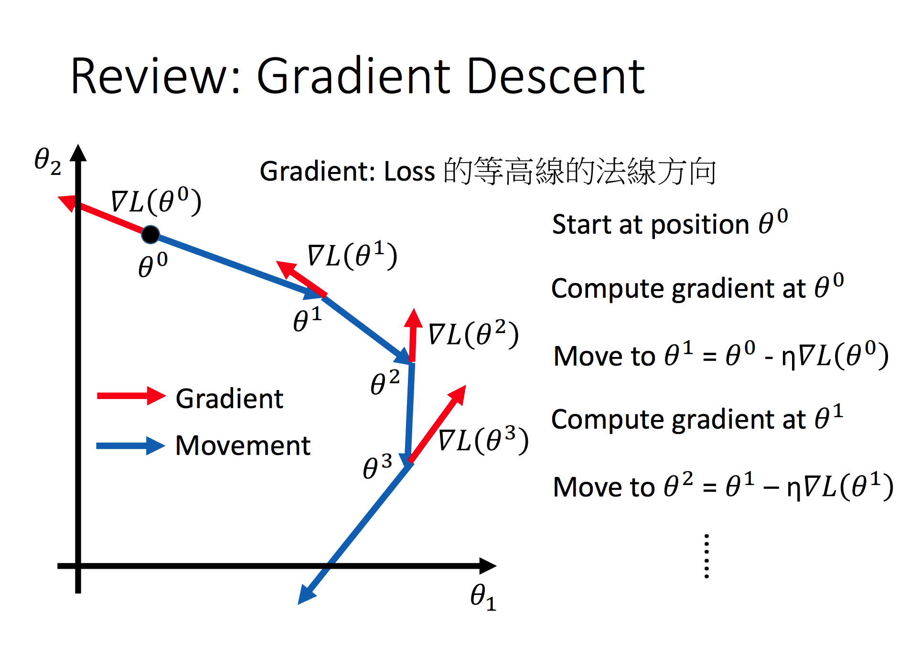
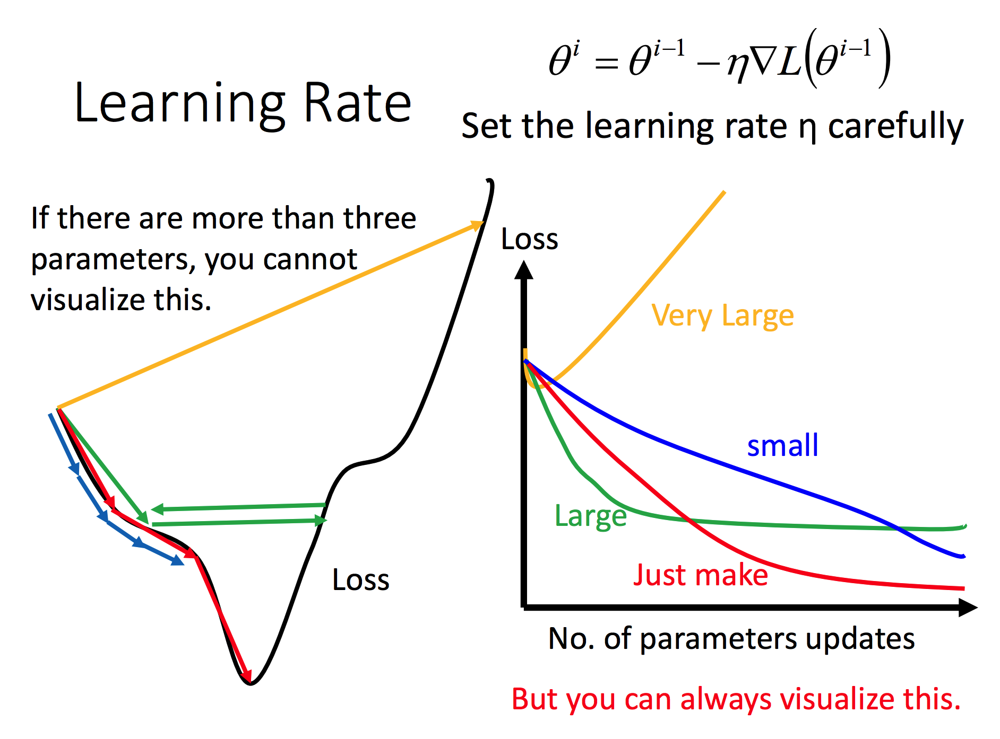
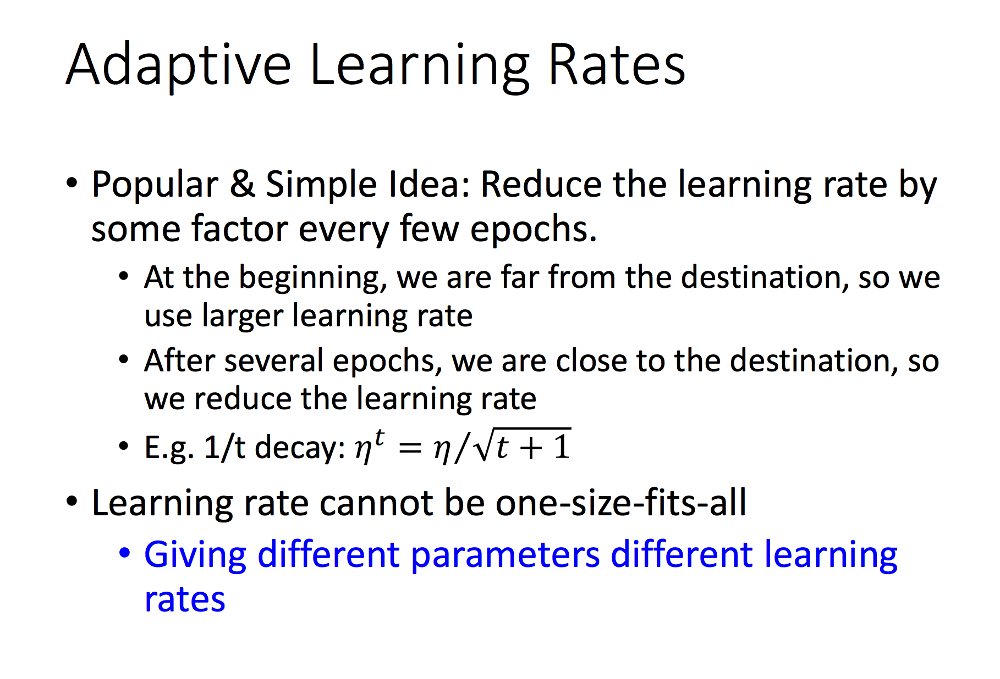

# Notes about Machine Learning(lhy 35)

---
## ML Lecture 0-1: Introduction of Machine learning

Regression和Classification:

Supervised Learning:有label

    Linear Model:
    Non_linear Model: DL, SVM, decision tree

Semisupervised Learning: 有的没label

    undone

Transfer learning:

    undone

Unsupervised Learning: 无label

    Machine Drawing:

Structured learning: 输出的是复杂的物件, 比如机器翻译问题输出的是句子。

    undone

Reinforcement Learning: 

    Supervised: 我们会告诉supervised learning正确答案是什么(Learning from teacher)
    Reinforcement: 从评价中学习，没有正确答案(Learning from critics)

*Fig.1.1 : 总结*

---
## [ML Lecture 1: Regression - Case Study](https://www.youtube.com/watch?v=fegAeph9UaA&list=PLJV_el3uVTsPy9oCRY30oBPNLCo89yu49&index=3)

Regression可以做什么:

    tasks: Stock Market Forecast、Self-driving Car、Recommendation

Regression是怎么做的:

    1. Model
    2. Goodness of Function, namely 利用traing data和loss function(衡量参数的好坏或者说衡量model的好坏)来做
    3. Gradient descent

## 
*Fig.2.1 : gradient descent*

convex可以理解成没有local minima的

复杂的模型不总是在testing data上表现好，过于复杂的模型可能会出现`Overfitting`

小技巧：if 的数学描述很可能是/delta

我们比较喜欢平滑的function，但是不喜欢太平滑的function

Regularization: 让函数更平滑。另外，做Regularization的时候是不用考虑bias的，因为bias只是让函数上下移动

总结：

    1. Gradient descent
    2. Overfitting and Regularization(后续给出更多的背后理论)

__Reference__

[2][本节课件](http://speech.ee.ntu.edu.tw/~tlkagk/courses/ML_2016/Lecture/Regression%20(v6).pdf)

---
## [ML Lecture 3-1: Gradient Descent]()

Gradient Descent review

## 

Tuning your learning rates

## 

通常情况下，learning rate是越来越小的

## 

比较简单的一种做法是Adagrad, 详细可见[ppt](http://speech.ee.ntu.edu.tw/~tlkagk/courses/ML_2016/Lecture/Gradient%20Descent%20(v2).pdf)

possition:上面ppt中的Adagrad

__Reference__

[3][本节课件]()

__待办__
* Transfer learning
* Machine Drawing

---
[1]35节课列表: [video and ppt](http://speech.ee.ntu.edu.tw/~tlkagk/courses_ML16.html)
